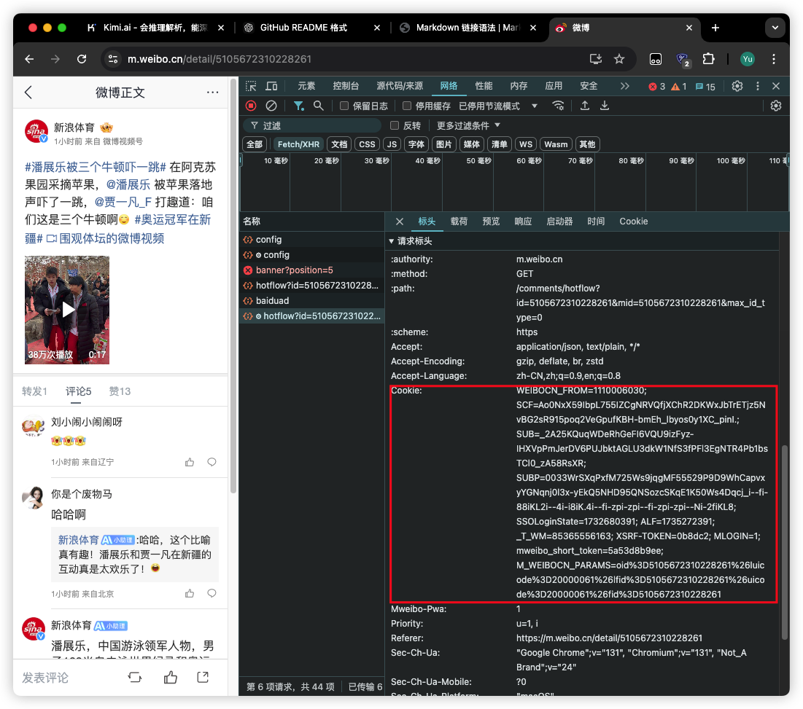

# 微博动态网页的内容识别和控制

> **注意：** 本项目作为课程作业的一部分，仅限于非商业用途，禁止任何形式的商业使用。仅供学习与教学使用。

此项目可根据用户昵称或者关键词爬取微博的blog内容，并对其使用Bert模型简单分类，调用Kimi的API做出用户画像，分析blog占比等。

# 目录

- [项目简介](#项目简介)
- [主要功能](#主要功能)
- [项目结构](#项目结构)
- [安装](#安装)
- [使用方法](#使用方法)
- [贡献](#贡献)

## 项目简介

`WeiBo-spider` 是一个基于 Python 和爬虫技术的微博数据抓取工具。该工具通过模拟浏览器访问微博，爬取指定关键词下的微博内容、用户信息以及相关的互动数据。该项目适用于数据分析、社交媒体研究等学术用途。

## 主要功能

- 根据指定的关键词爬取微博内容。
- 爬取微博下的评论、转发、点赞等互动信息。
- 获取用户信息，包括用户的微博内容、粉丝数量、关注数量等。
- 支持分页抓取，能处理微博的动态加载。　

## 项目结构

以下是项目的目录结构及说明：

```plaintext
.
├── BertClassifier-master/          # BERT分类器代码
│   ├── LICENSE                     # 许可证文件
│   ├── README.md                   # 该模块的说明文档
│   ├── dataset.py                  # 数据处理模块
│   ├── model.py                    # 模型定义
│   ├── predict.py                  # 模型预测脚本
│   ├── predict.py.bak              # 预测脚本备份文件
│   ├── requirements.txt            # Python依赖列表
│   ├── train.py                    # 模型训练脚本
│   └── figure/
│       └── model.png               # 模型架构图
├── Readme.md                       # 主项目说明文档
├── backend/                        # 后端服务代码
│   ├── app.py                      # 主后端服务入口
│   ├── test.py                     # 后端测试脚本
│   └── utils.py                    # 工具函数
└── web/                            # 前端代码
    ├── README.md                   # 前端说明文档
    ├── babel.config.js             # Babel 配置
    ├── jsconfig.json               # JavaScript 配置
    ├── package-lock.json           # 依赖锁定文件
    ├── package.json                # 前端依赖和脚本配置
    ├── public/                     # 静态资源目录
    │   ├── favicon.ico             # 网站图标
    │   └── index.html              # HTML 模板
    ├── src/                        # 源代码
    │   ├── App.vue                 # 主应用组件
    │   ├── assets/                 # 静态资源（图片、样式等）
    │   │   ├── leaves.webp
    │   │   └── logo.png
    │   ├── components/             # 公共组件
    │   │   ├── ContantBase.vue
    │   │   ├── GetUserInfo.vue
    │   │   ├── NavBar.vue
    │   │   └── NetworkGraph.vue
    │   ├── main.js                 # 前端入口文件
    │   ├── router/                 # 路由配置
    │   │   └── index.js
    │   ├── store/                  # Vuex 状态管理
    │   │   └── index.js
    │   └── views/                  # 页面组件
    │       ├── BlogRetransmission.vue
    │       ├── HomeView.vue
    │       ├── KeyWords.vue
    │       ├── StaisticsInfo.vue
    │       ├── UserInfo.vue
    │       └── UserPortrait.vue
    └── vue.config.js               # Vue 配置文件
```

## 安装

### 前提条件
 - Python 3.9.20
 - 需要的Python库：
    - beautifulsoup4==4.12.3
    - Flask==3.1.0
    - Flask_Cors==3.0.10
    - numpy==2.1.3
    - openai==1.55.2
    - Requests==2.32.3
    - scikit_learn==1.5.2
    - torch==2.5.1
    - tqdm==4.66.5
    - transformers==4.45.2
 - [node.js](https://nodejs.org/en)
 - vue/cli

### 安装步骤

1.克隆项目到本地

```bash
git clone https://github.com/Hiter-WY/WeiBo-spider.git
```

2.进入项目目录

```bash
cd WeiBo-spider
```

3.安装项目依赖
```bash
pip install -r requirements.txt
npm install -g @vue/cli
```
注意：这里的torch版本下载你自己电脑的对应的[pytorch](https://pytorch.org/get-started/locally/)版本

## 使用方法

1.配置爬虫脚本中的cookie和kimi api，以便模拟登录并获取数据，脚本中的爬取用户blog是不需要cookie的，查看该blog的转发需要，kimi的api只有做用户画像的时候才需要。

框中的部分为cookie对应内容，将其替换./backend/utils.py中的get_retransmission函数中的cookie以构造请求头。


kimi的api配置可以参考[Moonshot AI](https://platform.moonshot.cn/docs/guide/start-using-kimi-api)

2.启动后端，使用你常用的python编辑器，运行app.py，flask框架的默认端口是5000，请确保不会出现端口冲突。

3.启动项目前端
```bash
cd ./web
npm install #如果报错添加sudo，可能会出现读写权限问题
npm run serve
```

## 贡献

欢迎贡献！如果你有好的想法或者想改进该项目，请按照以下步骤进行：

1.Fork 本仓库

2.创建自己的分支 (git checkout -b feature-branch)

3.提交更改 (git commit -am 'Add new feature')

4.推送到分支 (git push origin feature-branch)

5.提交 Pull Request

## 许可证

该项目使用 MIT 许可证。